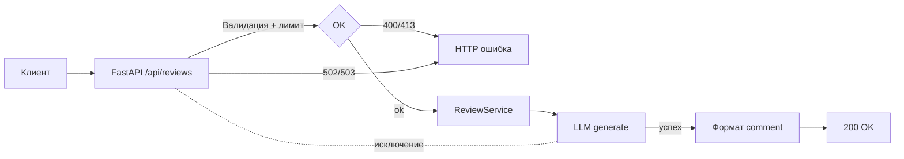

# ADR: решение для первого рабочего сценария

- Статус: proposed / accepted
- Дата: 2026-09-07
- Ответственные: команда интеграции API

## Контекст

TRAINING_PR.diff показывает простой FastAPI-эндпоинт `POST /api/reviews`, который передает `diff` в `ReviewService.review`, формируя промпт для `LLM.generate`. Нет валидации входа, лимита размера, обработки ошибок LLM; формат ответа не закреплен схемой. Это приводит к 500 при пропущенном поле `diff` и к неконтролируемым 500 при сбоях LLM.

## Решение

Минимальные изменения первого инкремента:
- Ввести валидацию входа (обязательное строковое поле `diff` и лимит длины N). Невалидный вход → 400, превышение лимита → 413.
- Обернуть вызов `LLM.generate` в обработку ошибок и маппить исключения в 502/503.
- Зафиксировать контракт успешного ответа `{ "comment": string }` через схему/модель.

## Рассмотренные альтернативы

| Альтернатива | Почему не выбрали сейчас |
|---|---|
| Асинхронизация и очереди | Сложнее, не требуется для первого инкремента; цель — стабилизировать контракты и ошибки |
| Рефакторинг промпта и защита от prompt injection | Требует отдельного дизайна и тестов; вынесено в следующий этап |
| Богатая модель ответа (структура findings, severity) | Увеличивает объем контракта; сначала стабилизируем базовый путь |

## Последствия и главный риск

- Положительные последствия:
  - Снижение 5xx за счет 4xx на валидации; контролируемые 502/503 при сбоях LLM.
- Ограничения:
  - Лимит N может быть неподходящим для некоторых клиентов; потребуется настройка.
- Главный риск:
  - Ошибки классификации (например, маппинг исключений LLM в неверный статус) и ложные 413 из-за неверно выбранного N.
- Как проверим риск:
  - Наблюдать метрики долей 4xx/5xx и p95; провести интеграционные и E2E тесты с граничными размерами.

## Архитектурная схема

## Как использовали AI

- Для чего: сформулировать минимально достаточное архитектурное решение.
- Тип промпта: ADR draft assist.
- Строка в [`prompts.md`](prompts.md): P1-02.
- Что проверили и исправили сами: адаптировали схему под реальные модули из diff; зафиксировали коды 400/413/502/503.
