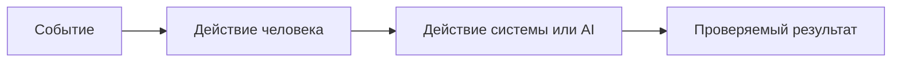
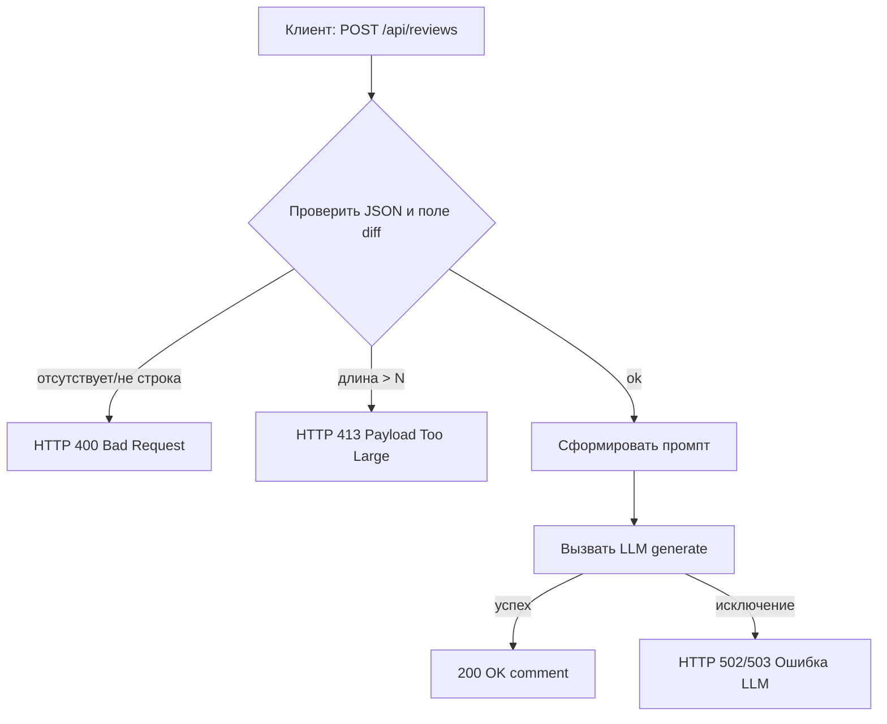

# Анализ процесса: AS IS и TO BE

## AS IS

Опишите текущий процесс от события до результата. Укажите участников, задержки, ручные операции и точки потери информации.

## TO BE

Опишите один небольшой процесс после изменения. Используйте BPMN, DFD или IDEF*. Если выбранный формат не рендерится в GitHub, положите рядом исходник и PNG, а здесь добавьте ссылки.

## Разница

| Что меняется | AS IS | TO BE | Как проверим изменение |
|---|---|---|---|
|  |  |  |  |

## Как использовали AI

- Для чего:
- Тип промпта:
- Строка в [`prompts.md`](prompts.md):
- Что проверили и исправили сами:

---

Заполнение по TRAINING_PR.diff

## AS IS (детализация)

- Событие: клиент отправляет POST на `/api/reviews` с JSON-телом.
- Эндпоинт FastAPI `create_review(payload: dict)` обращается к `review_service.review(payload["diff"])` без валидации. При отсутствии ключа возникает `KeyError` и 500. Evidence: TRAINING_PR.diff app/api.py:35-38.
- `ReviewService.review(diff: str)` формирует промпт "Review this pull request and find problems:\n{diff}" и вызывает `llm.generate(prompt)` синхронно. Возвращает `{ "comment": answer }`. Evidence: app/review_service.py:19-22.
- Исключения из LLM не перехватываются → 500. Нет лимита размера `diff`.

## TO BE (минимальный инкремент)

- Валидация входа: обязательное строковое поле `diff`; длина ≤ N (например, 50_000). Невалидный вход → 400; превышение лимита → 413.
- Обработка ошибок LLM: try/except вокруг `llm.generate` с маппингом в 502/503.
- Успешный ответ стабилен: `{ "comment": string }`.

## Разница (таблица)

| Что меняется | AS IS | TO BE | Как проверим изменение |
|---|---|---|---|
| Валидация входа | Нет, `payload["diff"]` → `KeyError` | Обязательное строковое поле, 400 при ошибке | E2E: `{}` → 400; Integration через TestClient |
| Лимит размера | Нет ограничений | 413 при превышении N | E2E: строка длиной N+1 → 413 |
| Ошибки LLM | Исключение пробрасывается как 500 | Перевод в 502/503 | Интеграция: заглушка LLM кидает Exception → 502/503 |
| Контракт ответа | Не зафиксирован схемой | `{comment: string}` | Unit: ключ `comment` присутствует |

## Как использовали AI (факт)

- Для чего: структурировать AS IS/TO BE и различия по фактам TRAINING_PR.diff.
- Тип промпта: structured review.
- Строка в [`prompts.md`](prompts.md): P1-02.
- Что проверили и исправили сами: не расширяли область; зафиксировали минимальные изменения.
