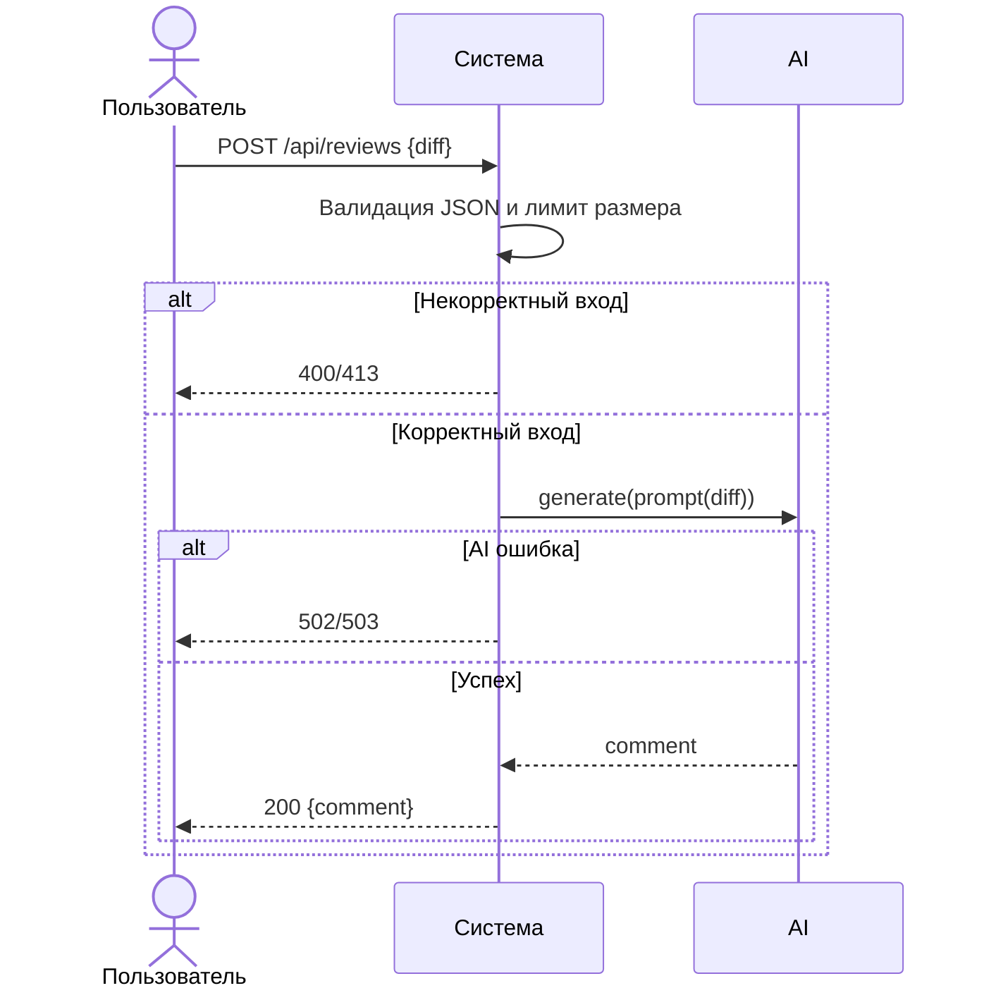

# Use cases и user stories

## Первый рабочий сценарий

**Когда** интегратор отправляет POST на `/api/reviews` с корректным JSON `{ "diff": "..." }`, **система** валидирует вход и длину `diff`, безопасно вызывает LLM и **пользователь получает** стабильный ответ `{ "comment": "..." }` или контролируемую 4xx/5xx ошибку с понятным кодом.

Не входит в этот сценарий:

- Аутентификация и тарифы, мультиязычность, расширенная структура отчёта, логирование/метрики.

## Use case

| Поле | Значение |
|---|---|
| Актор | Интегратор API (клиент сервиса) |
| Триггер | Необходимость получить автоматический code review по diff |
| Предусловия | Доступен HTTP-эндпоинт `/api/reviews`; подготовлен текстовый `diff` |
| Основной результат | 200 OK и тело `{ "comment": string }` |
| Ошибка или отказ | 400 при отсутствии/неверном типе `diff`; 413 при превышении лимита; 502/503 при ошибке LLM |



## User stories и acceptance criteria

```gherkin
Feature: Создание обзора по diff через API

  Scenario: Позитивный ответ 200
    Given доступен эндпоинт /api/reviews
    And подготовлен корректный JSON с ключом diff и разумной длиной
    When клиент делает POST на /api/reviews с телом {"diff": "diff --git a/file b/file..."}
    Then сервер отвечает 200
    And тело содержит ключ comment со строкой

  Scenario: Отсутствует ключ diff
    Given доступен эндпоинт /api/reviews
    When клиент делает POST на /api/reviews с пустым телом {}
    Then сервер отвечает 400

  Scenario: Превышен лимит длины diff
    Given установлен лимит длины N символов
    When клиент делает POST на /api/reviews с diff длиной N+1
    Then сервер отвечает 413

  Scenario: Ошибка LLM
    Given LLM.generate бросает исключение
    When клиент делает POST на /api/reviews с валидным diff
    Then сервер отвечает 502 или 503
```

## Как использовали AI

- Для чего: зафиксировать первый рабочий сценарий и критерии приемки из контекста diff.
- Тип промпта: structured review.
- Строка в [`prompts.md`](prompts.md): P1-02.
- Что проверили и исправили сами: оставили минимальные роли/потоки без расширения требований.
