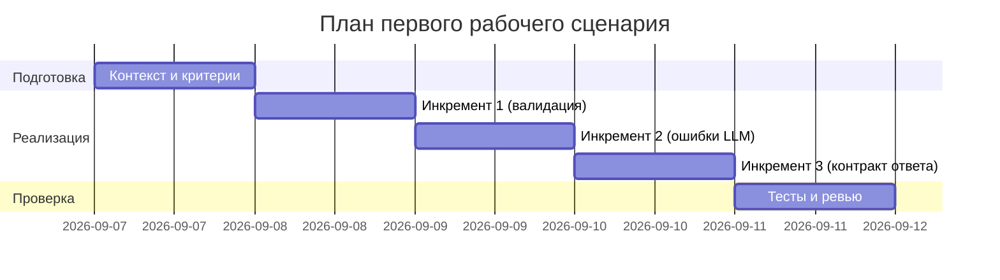

# План поставки

## Инкременты и ответственность

| Инкремент | Наблюдаемый результат | Что делает человек | Что делает AI или субагент | Проверка | Зависимости |
|---|---|---|---|---|---|
| 1: Валидация входа | 400 при отсутствии/не том типе `diff`; 413 при превышении лимита | Определяет N, формулирует правила валидации | Предлагает Pydantic-модель/схему и обработку ошибок | E2E: `{}` → 400; N+1 → 413 | TRAINING_PR.diff, FastAPI |
| 2: Обработка ошибок LLM | Исключения маппятся в 502/503 | Решает коды/тексты ответов, пишет тест-кейсы | Генерирует шаблон middleware/try-except | Интеграция: заглушка LLM кидает Exception → 502/503 | 1 |
| 3: Контракт ответа | Стабильный `{comment}` и OpenAPI-описание | Подтверждает формат, добавляет пример | Генерирует схему ответа и примеры | Unit: ключ comment; OpenAPI проверка | 1 |

## Диаграмма Ганта

Замените даты и задачи на свой план.

## Как использовали AI

- Для чего: разбить минимальный объём изменений на проверяемые инкременты.
- Тип промпта: planning assist.
- Строка в [`prompts.md`](prompts.md): P1-02.
- Что проверили и исправили сами: проверили связность зависимостей и соответствие измеримым критериям.
